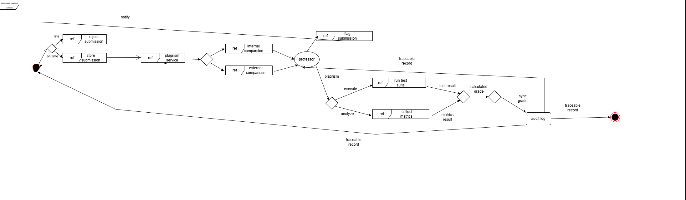
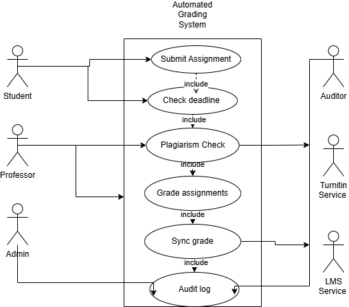

 ## Practical 2: UML – Automated Grading System

## Overview
This practical focuses on designing an Automated Grading System to replace the current manual grading process used in the university’s Software Engineering course. At present, students submit assignments through GitHub, and professors manually download, run, and evaluate the code using tools like VS Code and terminal. This process is slow, repetitive, and lacks plagiarism detection and automation. The proposed system aims to automate grading, detect plagiarism, store results securely, and integrate with the university LMS.

## Actors
The system has a few main actors. Students are the ones submitting assignments and checking their grades. Professors set the grading criteria and deadlines, then review the grades our system generates. TurnItIn handles the plagiarism detection (we're using their external service since building that ourselves would be too complex). The university's LMS stores and displays grades to students. Finally, the Regulatory Body periodically audits the grading records to ensure everything's legitimate.

## Requirements
Basically, students need to be able to upload code and have it automatically graded. Every grading result needs to be logged so we can trace what happened during audits. The system has to check for plagiarism using both our own checks and TurnItIn's service. It needs to work with the existing LMS without breaking it. We also have to reject late submissions but allow students to try multiple times if they want. Professors should be able to set their own grading rules and submission deadlines.

## Constraints
The LMS is a legacy mainframe system and cannot be modified, so it must be treated as an external system. The university has a limited budget, so third-party services like TurnItIn are used instead of building everything from scratch. Audit logs are mandatory because grade records are reviewed annually by a regulatory authority.

## Task 1 – Interaction Overview Diagram (Manual Process)
The first diagram represents the current manual workflow without system automation. A student submits code to GitHub, and the professor downloads and runs it manually. The professor checks plagiarism using TurnItIn and receives a report. Based on the results, the professor assigns a grade and enters it into the LMS. The student then views the grade, and the regulatory body later audits the records. This process highlights inefficiency and lack of automation.

## Task 2 – Use Case Diagram (System Functions)
The use case diagram defines the functional capabilities of the automated system. The main use cases include submitting assignments, checking deadlines, running code, grading submissions, checking plagiarism, syncing grades with the LMS, and maintaining audit logs. Some use cases always occur together, such as running code and grading, which are modeled using include relationships. Conditional behavior, such as rejecting late submissions, is modeled using extend relationships. This diagram clearly defines system functionality and actor interactions.

## Task 3 – Interaction Overview Diagram (System-Supported)
This diagram shows how the automated system handles the workflow using swimlanes. The professor first sets the grading rules and deadline. The student submits the assignment, and the system checks whether it is late. If it is late, the submission is rejected; otherwise, the system runs the code, grades it, and performs plagiarism checks using both internal logic and TurnItIn. The results are stored in an audit log and sent to the LMS. The student can view the results, and the professor can review them. The regulatory body accesses audit records when required.

## Quality Attributes
**Auditability**: We store everything in an audit log so if there's ever a question about a grade, we can trace exactly what happened. 
**Reliability**: By checking deadlines before we process anything, we make sure nothing gets processed that shouldn't. 
**Scalability**: Since grading is automated, we can handle hundreds of students at once without hiring more staff. 
**Integration**: We treat the LMS and TurnItIn as separate external systems, which keeps things simpler and avoids messing with both of them. **Cost Efficiency**: Using existing services like TurnItIn instead of building plagiarism detection ourselves saves the university a lot of money.

## Reflection
I created three UML diagrams to show the system from different angles, and honestly it took me a while to understand how they all fit together. The biggest learning moment was realizing how include and extend relationships actually work—I initially confused them and had to re-read the material a few times. The hardest decision was whether the LMS should be inside or outside the system boundary. I kept going back and forth on this, thinking it should be inside since students interact with it, but finally realized it had to be external since the university won't let us modify it. Designing the swimlane diagram was also trickier than I expected I made several drafts before the flow actually made sense. If I did this again, I'd sketch out the rough ideas before jumping into the actual UML tool, and I'd identify all the constraints upfront instead of discovering them as I go.

## Conclusion
This automated grading system would make a real difference. Instead of professors spending hours manually grading code and checking plagiarism, the system handles most of the work automatically. It reduces errors, keeps everything logged for regulatory audits, and scales up easily when the university has more students. The key is that we're not trying to build everything from scratch we're using existing services where it makes sense.

## References
- https://www.geeksforgeeks.org/interaction-overview-diagrams-unified-modelinglanguage-uml/  
- https://www.visual-paradigm.com/guide/uml-unified-modeling-language/what-is-interaction-overview-diagram/  
- https://www.geeksforgeeks.org/use-case-diagram/  

## AI History
https://chat.deepseek.com/share/jti1znk430gytzlgug
