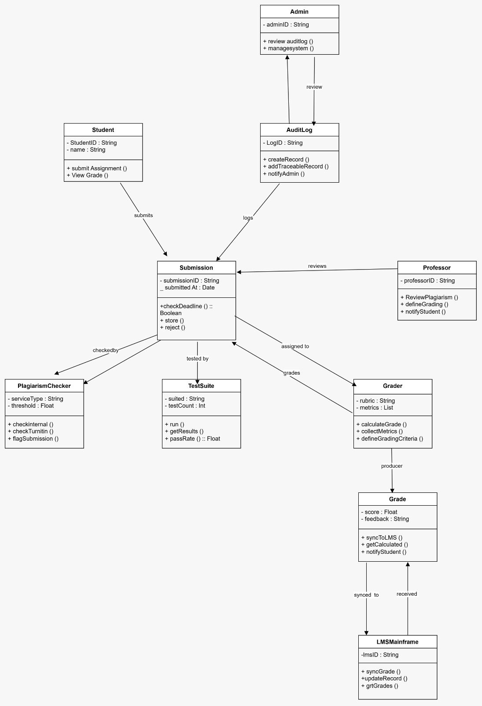
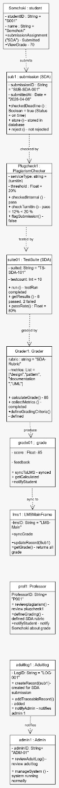

# Practical Report: Class Diagram and Object Diagram

## About This Practical

This practical is about making a Class Diagram and an Object Diagram for an Automated Grading System. The class diagram shows the main classes and how they are linked. The object diagram shows one example using actual values.

## People And Parts In The System

- Student: submits assignments and checks grades
- Professor: creates rubrics, gives feedback, and syncs grades to LMS
- PluginChecker: checks plagiarism using Turnitin
- TestSuite: runs automatic tests on code submissions
- LMSMainFrame: stores and manages grades in the LMS

## Main Requirements

From the scenario, I picked out these main things the system should do:

1. Students should be able to submit assignments
2. The system should check deadlines automatically
3. It should detect plagiarism
4. Code submissions should be tested automatically
5. Grading should follow the rubric
6. Professors should be able to review and sync grades to the LMS
7. Students should get notified when grades are ready

## Diagrams

### 1. Class Diagram

For the class diagram, I included the main classes, their attributes, methods, and relationships. The classes I used are:

- Student
- Submission
- PluginChecker
- TestSuite
- Graded
- Professor
- LMSMainFrame

I also showed the relationships between them, like submits, checked by, tested by, graded by, and synced to.

> 

### 2. Object Diagram

For the object diagram, I showed one real example at a specific moment. This uses actual values instead of just class names:

- Somchoki: studentID = S001, name = Somchoki
- sub1: submission for SDA, submitted on 2026-04-06, on time
- Plugcheck1: Turnitin check, threshold 20%, similarity 12%, so no plagiarism was flagged
- suite01: 10 tests, 8 passed, 2 failed, so pass rate = 80%
- Grad1: rubric = design, pattern, documentation, UML, final grade = 85
- proff1: score = 85, feedback given, synced to LMS
- lms1: LMS updates records and returns all grades

> 

## Short Summary

This practical helped me see the difference between a class diagram and an object diagram. The class diagram is more like a template, while the object diagram is like a snapshot of the system with real values. My object diagram matches the class diagram and shows how the system could work in a real situation.

## Quick Difference

| | Class Diagram | Object Diagram |
| - | ------------- | -------------- |
| What it is | A blueprint or template | A snapshot at one moment |
| What it shows | Classes, attributes, methods, and relationships | Actual objects with real values |
| Example | Student with studentID, name, email | Somchoki with studentID = S001, name = Somchoki |
| Changes over time? | No, it stays the same | Yes, different time means a different snapshot |
| Simple analogy | A blank form | A filled form |

# AI History
https://chat.deepseek.com/share/xweltdv217m2wkxr75